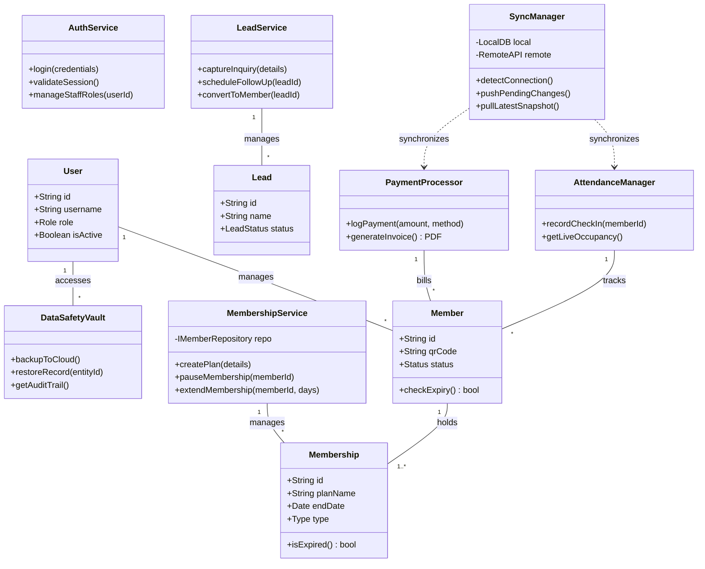

# Class Diagram — FitFlow

## **Overview**

This class diagram represents the core architectural layers of the **FitFlow** platform, following **Clean Architecture principles** to ensure a clear separation between data models and business logic. The design is centered around **operational resilience**, ensuring that critical services like attendance tracking and payment processing can function autonomously in a local environment before synchronizing with the cloud. By decoupling the "Staff" (User) from the "Client" (Member), the system provides a secure, role-based environment that scales from a single gym desk to a multi-trainer facility.

---

---

## **Class Descriptions**

### **Domain Models (Entities)**

| Class | Description |
| --- | --- |
| **User** | Represents internal personnel, including the Gym Owner, Staff, and Trainers. It holds the security context and assigned roles for system access. |
| **Member** | The core profile for gym clients, containing unique identifiers like QR codes and general health/status flags. |
| **Membership** | Represents a specific contractual plan held by a member. It tracks the type (Subscription, PT, Class Pack) and expiration logic. |
| **Lead** | Captures prospective member data, tracking their position within the sales funnel from "New Enquiry" to "Converted Member". |

### **Service Layer (Business Logic)**

| Class | Description |
| --- | --- |
| **AuthService** | Manages staff sessions, JWT validation, and the enforcement of Role-Based Access Control (RBAC). |
| **MembershipService** | Coordinates complex lifecycle events such as pausing memberships for medical reasons or extending end dates. |
| **PaymentProcessor** | Handles omnichannel payment logging (UPI, Cash, Card) and triggers the generation of professional, branded invoices. |
| **SyncManager** | The heart of the hybrid mode. It monitors internet connectivity and reconciles "Pending" local records with the cloud database. |
| **AttendanceManager** | Manages the high-speed QR check-in workflow and provides real-time data for the live occupancy dashboard. |
| **LeadService** | Automates the sales pipeline by scheduling follow-up reminders and streamlining the transition of inquiries into active members. |
| **DataSafetyVault** | Oversees automated cloud backups and provides the interface for restoring accidentally deleted items via secure audit trails. |