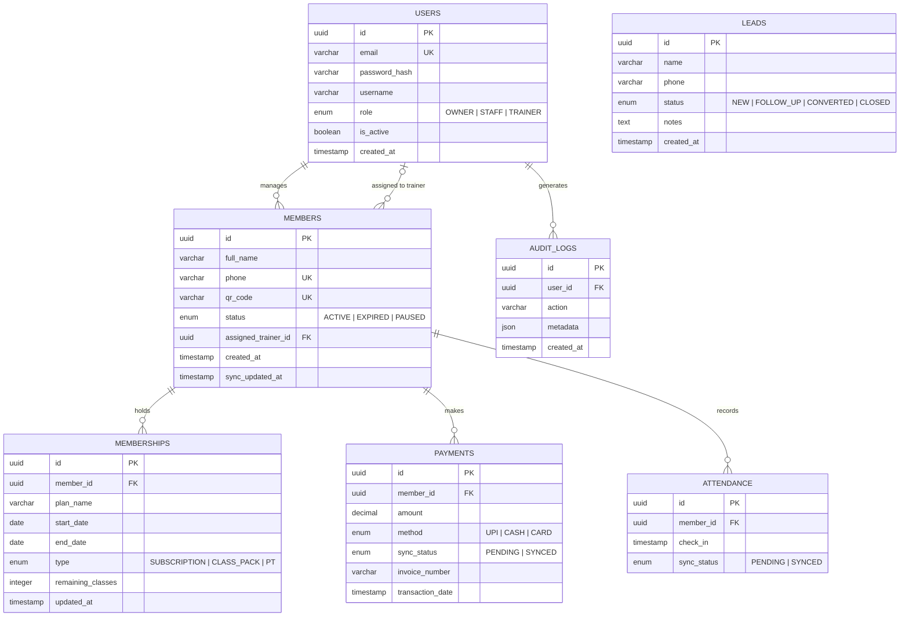

### **1. Overview**

The FitFlow database is the resilient backbone of the gym's daily operations. Rather than just storing data, it is designed to keep the business moving even when real-world challenges—like a dropped internet connection in a basement facility—occur. By prioritizing a "local-first" approach, it ensures that every check-in, payment, and membership update is captured instantly on the gym floor and safely mirrored to the cloud the moment the connection returns. It is built to give the owner total peace of mind, ensuring that the technology works as hard as the athletes it tracks.

### **2. ER Diagram**

### **3. Table Summary**

| Table | Description |
| --- | --- |
| `USERS` | Internal accounts for staff with Role-Based Access Control (Owner, Staff, Trainer). |
| `MEMBERS` | The primary database for gym members, including contact details and unique QR identifiers for check-ins. |
| `MEMBERSHIPS` | Detailed records of specific plan types, including fixed-duration subscriptions, class packs, and personal training (PT) packages. |
| `PAYMENTS` | Financial transaction logs for UPI, Cash, and Card payments, including billing details and sync status for offline tracking. |
| `ATTENDANCE` | Logs of daily member check-ins used to monitor real-time occupancy and retention trends. |
| `LEADS` | A sales pipeline database to manage inquiries, track follow-ups, and monitor conversion rates. |
| `AUDIT_LOGS` | Security-focused logs that record system actions to support data recovery and transparency. |

### **4. Key Indexes**

| Table | Index | Purpose |
| --- | --- | --- |
| `USERS` | `(email)` | Facilitates high-speed authentication lookups during login. |
| `MEMBERS` | `(qr_code)` | Enables instant identification of members during the high-traffic QR check-in process. |
| `MEMBERSHIPS` | `(end_date)` | Optimized for identifying members whose plans are expiring soon for automated renewal reminders. |
| `PAYMENTS` | `(sync_status)` | Critical for the Hybrid Sync Engine to identify and push pending offline payments to the cloud. |
| `ATTENDANCE` | `(sync_status)` | Identifies local check-in records that need to be reconciled with the remote server. |
| `LEADS` | `(status)` | Groups inquiries for quick follow-up management within the sales dashboard. |

### **5. Relationship Summary**

* **User Authority:** Internal `USERS` (Staff) manage `MEMBERS` and generate `AUDIT_LOGS` for all critical actions.
* **Member Activity:** Each `MEMBER` is linked to one or more `MEMBERSHIPS`, performs multiple `ATTENDANCE` check-ins, and generates multiple `PAYMENTS` records over time.
* **Trainer Assignment:** Specific `USERS` with the `TRAINER` role can be directly assigned to `MEMBERS` to manage personal training packages.
* **Financial Flow:** `PAYMENTS` and `MEMBERSHIPS` are closely linked through the member to ensure that access is only granted when active, paid-up plans exist.