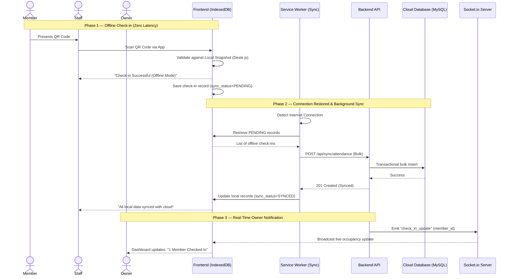

# Sequence Diagram — FitFlow

## **Overview**

This diagram maps out the "invisible" work that happens when a gym's internet goes down during the busiest hour of the day. It illustrates the seamless transition from a high-speed, local check-in at the front desk to the automatic background reconciliation that happens the moment the Wi-Fi returns. This flow ensures that the staff never has to tell a member to "wait for the system," while the gym owner stays perfectly informed through real-time dashboard updates once the data is safely in the cloud.

---

---

## **Flow Summary**

| Phase | Description | Key Patterns Used |
| --- | --- | --- |
| **1. The Offline Check-in** | During an outage, the system bypasses the network entirely, validating the member's QR code against a local "snapshot" and recording the entry with a "pending" flag to ensure zero operational downtime. | **Local-First**, Optimistic UI |
| **2. The Silent Recovery** | The Service Worker monitors connectivity in the background; once the internet returns, it automatically gathers all pending offline records without requiring any manual action from the staff. | **Background Sync**, Observer |
| **3. The Cloud Handshake** | Local data is pushed to the API in a single transactional batch to ensure that every check-in is recorded in the cloud database correctly and mapped to the right member profile. | **Transactional Update**, Bulk API |
| **4. Real-Time Awareness** | Once the database is updated, the server triggers a WebSocket event that pushes a live notification to the owner's mobile device, instantly reflecting the true occupancy of the gym. | **WebSocket**, Pub-Sub |