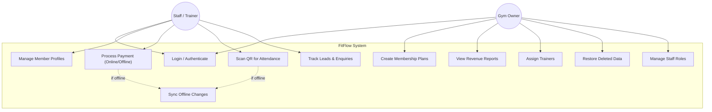

# Use Case Diagram — FitFlow

## Overview

This diagram shows all major use cases for the FitFlow platform, organized by the two primary actors: **Gym Owner** and **Staff / Trainer**.
The system focuses on **hybrid offline operations**, **membership management**, **billing integrity**, and **data safety**.

---

---

## Use Case Descriptions

| # | Use Case | Actors | Description |
| --- | --- | --- | --- |
| UC1 | Login / Authenticate | All | Secure access using role-based authentication (Owner, Staff, Trainer). |
| UC2 | Manage Member Profiles | Staff | Maintain a complete database of members with contact info and activity history. |
| UC3 | Create Membership Plans | Owner | Design flexible membership plans, class packs, and PT packages. |
| UC4 | Process Payment | Staff | Securely log payments via UPI, Cash, or Card, even in offline mode. |
| UC5 | Scan QR for Attendance | Staff | Track daily member check-ins instantly using QR codes. |
| UC6 | Track Leads & Enquiries | Staff | Centralize and manage inquiries from walk-ins and online channels in one dashboard. |
| UC7 | View Revenue Reports | Owner | Analyze monthly revenue, daily collections, and overall business health. |
| UC8 | Assign Trainers | Owner | Link specific trainers to member packages or group sessions for performance tracking. |
| UC9 | Restore Deleted Data | Owner | Instantly recover accidentally deleted members or records via secure audit logs. |
| UC10 | Sync Offline Changes | System | Automatically reconcile local offline data with the cloud once connectivity is restored. |
| UC11 | Manage Staff Roles | Owner | Configure and assign roles and responsibilities for gym employees. |